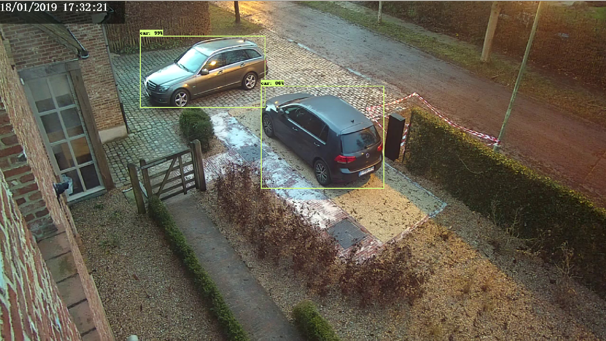

# Camera feed object detector using Tensorflow Serving

> Program to detect objects using Tensorflow Detection API and YOLO on a video stream. The scripts are written in Python3. For YoloV3, the model is stored locally so we don't need to utilize Tensorflow Serving.

[](https://www.python.org/downloads/release/python-360/)
[](https://opensource.org/licenses/Apache-2.0)



## Table of Contents

-   [Folder structure](#folder-structure)
-   [Dependencies](#dependencies)
-   [Installation](#installation)
-   [Usage](#usage)
    -   [Config file](#config-file)
    -   [Tensorflow Serving](#tensorflow-serving)
    -   [Detecting Objects](#detecting-objects)
        -   [Tensorflow Object Detection API](#tensorflow-object-detection-api)
        -   [YoloV3](#yolov3)
-   [Contributing](#contributing)
-   [Sources](#sources)
    -   [COCO](#coco)
    -   [Tensorflow Serving](#tensorflow-serving-1)
    -   [Yolo](#yolo)
    -   [Tensorflow Object Detection API](#tensorflow-object-detection-api-1)

## Folder structure

    .
    ├── docs                                # Documentation about TensorFlow Extended and my research
    │
    ├── object_detection                    # The actual code to detect objects
    │   ├── core                            # Helper functions from Tensorflow Detection API
    │   ├── data                            # Extra content (now Pickle of COCO categories)
    │   ├── utils                           # Helper functions from Tensorflow Detection API
    │   └── feed.py                         # Gets a video feed, predicts ands shows the detections
    │
    ├── tf_serve                            # Dockerfile and models for Tensorflow Serving
    │   ├── config                          # Configs
    |   |   └── model_config                # Config file for the specific models
    │   ├── models                          # Neural networks, exported as Tensorflow Serving models
    │   └── Dockerfile                      # Custom build of the Tensorflow/Serving image
    │
    ├── scripts                             # Bash scripts works only on Linux and MacOs
    │   └── tunnel-ip                       # Portforward remote ip via SSH
    │
    ├── yolo                                # YOLO object detection, without Tensorflow Serving
    │   ├── model                           # Modelfiles
    |   |   ├── coco.names                  # COCO category names
    |   |   └── darknet_yolov3_tiny.pb      # Converted model from YoloV3
    │   ├── utils                           # Helper functions from Paweł Kapica
    |   |   └── utils.py                    # Functions to create detection boxes
    │   └── feed.py                         # Gets a video feed, predicts ands shows the detections
    │
    ├── Pipfile                             # Defenition of our Python environment
    └── config.ini                          # Global defenitions of the used parameters

## Dependencies

This build is based on Tensorflow Object Detection API which depends on the following libraries:

-   Python
    -   Pillow
    -   Jupyter notebook
    -   Matplotlib
    -   Tensorflow (>=1.9.0)
    -   Requests
    -   OpenCV
    -   Pipenv
-   Docker

Luckily all these Python packages are all declared inside a Pipenv.

## Installation

Install [Python3](https://python.org).

Clone or download this repo:

```bash
git clone https://github.com/MoerkerkeLander/camera-feed-object-detector-tf-serve.git
cd camera-feed-object-detector-tf-serve
```

To enable the Python environment we use Pipenv. If you don't have this installed, we can use pip:

```bash
pip install pipenv
```

To setup Pipenv and install all the dependencies:

```bash
pipenv install -d
```

All the Python packages and the correct version of Python itself (3.6) should now be installed inside an virtual environment.

## Usage

### Config file

To share parameters between our different scripts I created a config.ini file.
Here you can configure which video feed or video file the script will be analysing and which model it will use.

**Note**: I created my own config file which is linked to my setup of cameras.
To link your cameras I propose using a feed that uses the [RTSP protocol](https://en.wikipedia.org/wiki/Real_Time_Streaming_Protocol) or you can use a video file.
The keys are already predefined, so just fill in the corresponding value appropriately inside the config_template.ini.

### Tensorflow Serving

Install [Docker](https://www.docker.com/products/docker-desktop).

Build the Docker image using the configurations inside the Dockerfile. The name of the image is object-detect.

```bash
docker build -t object-detect ./tf-serve
```

Run the Docker image.

```bash
docker run --name object-detect -h 0.0.0.0 --network="host" --rm -d object-detect:latest
# --name        For easy referencing this container
# --network     Setup network as host
# --rm          Removes container when it is stopped
# -d            Daemonize the docker container
# -h            Setup hostname, so we can access it using localhost
```

Now Tensorflow Serving is running inside a Docker container. We can access it by sending a REST request or a gRPC call. I used REST in favor of gRPC because it is the simplest to setup. Inside the models directory there are three exported models from the [model zoo](https://github.com/tensorflow/models/blob/master/research/object_detection/g3doc/detection_model_zoo.md). These are converted using the [export_inference_graph.py](https://github.com/tensorflow/models/blob/master/research/object_detection/export_inference_graph.py) from the Tensorflow Object Detection API.

To check if the container is running properly:

```bash
docker ps

# OUTPUT:
> CONTAINER ID        IMAGE                  COMMAND                  CREATED             STATUS              PORTS               NAMES
> 7507a1d4e430        object-detect:latest   "tensorflow_model_se…"   15 seconds ago      Up 14 seconds                           object-detect
```

Now that Tensorflow Serving is working correctly we can start detecting some objects! You can use Tensorflow Detection API with Tensorflow Serving or YoloV3.

### Detecting Objects

Firstly, enter the virtual environment inside the root of the repository:

```bash
pipenv shell
```

Now we can execute the different Python scripts.

#### Tensorflow Object Detection API

```bash
python object_detection/feed.py
```

#### YoloV3

```bash
python yolo/feed.py
```

### Portforwarding

Now you can detect objects using the IP address of your own camera, this can only be done locally inside your home network. I wrote a little script that portforwards your camera's IP and port to your local machine using SSH. If done correctly you can access your camera and its feed from your local machine without being on premise.

*Note*: this will only work on Linux and MacOs, if you want to achieve the same thing on Windows, please follow the instructions on: [How to configure an SSH tunnel on Putty](https://blog.devolutions.net/2017/4/how-to-configure-an-ssh-tunnel-on-putty).

To run the script from the root of the repository:

```bash
./scripts/tunnel-ip REMOTEIP REMOTEPORT LOCALPORT USER PUBLICIP
```

For example:

```bash
./scripts/tunnel-ip 192.168.0.60 88 8888 lander 8.8.8.8
```

When it's run successfully, you can check if it works:

```bash
# use sudo before the command if you want to see the program name
netstat -tulpn

# OUTPUT
> Active Internet connections (only servers)
> Proto Recv-Q Send-Q Local Address           Foreign Address         State       PID/Program name
> tcp        0      0 127.0.0.1:631           0.0.0.0:*               LISTEN      424/cupsd
> tcp6       0      0 :::8500                 :::*                    LISTEN      7568/tensorflow_mod
> tcp6       0      0 :::8501                 :::*                    LISTEN      7568/tensorflow_mod
> tcp6       0      0 ::1:631                 :::*                    LISTEN      424/cupsd
> tcp6       0      0 ::1:8888                :::*                    LISTEN      31429/ssh
> udp        0      0 0.0.0.0:5353            0.0.0.0:*                           413/avahi-daemon: r
> udp        0      0 0.0.0.0:57012           0.0.0.0:*                           413/avahi-daemon: r
> udp        0      0 0.0.0.0:68              0.0.0.0:*                           421/dhcpcd
> udp        0      0 0.0.0.0:631             0.0.0.0:*                           478/cups-browsed
> udp6       0      0 :::5353                 :::*                                413/avahi-daemon: r
> udp6       0      0 :::47144                :::*                                413/avahi-daemon: r
> udp6       0      0 :::546                  :::*                                421/dhcpcd
```

The local port you had chosen should be in the table with the SSH program name. I used port 8888.

## Contributing

1.  Fork it (<https://github.com/MoerkerkeLander/camera-feed-object-detector-tf-serve>)
2.  Create your feature branch (`git checkout -b feature/fooBar`)
3.  Commit your changes (`git commit -am 'Add some fooBar'`)
4.  Push to the branch (`git push origin feature/fooBar`)
5.  Create a new Pull Request

## Sources

All my sources are written down in a separate file. Check it out [here](SOURCES.md).
